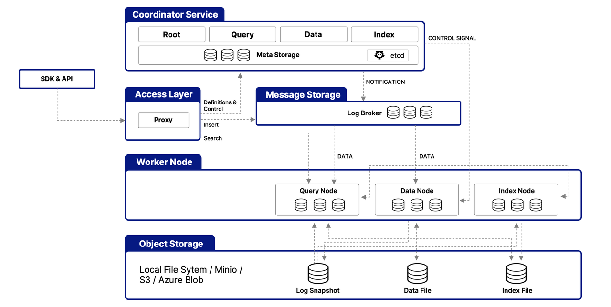

# zero-milvus-boot

# 1. 概述
## 1.1. 什么是Milvus
> Milvus 是一种高性能、高扩展性的向量数据库，可在从笔记本电脑到大型分布式系统等各种环境中高效运行。它既可以开源软件的形式提供，
> 也可以云服务的形式提供。 Milvus 是 LF AI & Data Foundation 下的一个开源项目，以 Apache 2.0 许可发布。
> 大多数贡献者都是高性能计算（HPC）领域的专家，擅长构建大型系统和优化硬件感知代码。
> 核心贡献者包括来自 Zilliz、ARM、NVIDIA、AMD、英特尔、Meta、IBM、Salesforce、阿里巴巴和微软的专业人士

## 1.2. 是什么让 Milvus 具有如此高的可扩展性
> 2022 年，Milvus 支持十亿级向量，2023 年，它以持续稳定的方式扩展到数百亿级，为 300 多家大型企业的大规模场景提供支持，
> 包括 Salesforce、PayPal、Shopee、Airbnb、eBay、NVIDIA、IBM、AT&T、LINE、ROBLOX、Inflection 等。 
> Milvus 的云原生和高度解耦的系统架构确保了系统可以随着数据的增长而不断扩展：<br/>
> 
> Milvus 本身是完全无状态的，因此可以借助 Kubernetes 或公共云轻松扩展。此外，Milvus 的各个组件都有很好的解耦，
> 其中最关键的三项任务--搜索、数据插入和索引/压实--被设计为易于并行化的流程，复杂的逻辑被分离出来。
> 这确保了相应的查询节点、数据节点和索引节点可以独立地向上和向下扩展，从而优化了性能和成本效率。

## 1.3. Milvus 支持的搜索类型
> Milvus 支持各种类型的搜索功能，以满足不同用例的需求：

- ANN 搜索：查找最接近查询向量的前 K 个向量。 
- 过滤搜索：在指定的过滤条件下执行 ANN 搜索。 
- 范围搜索：查找查询向量指定半径范围内的向量。 
- 混合搜索：基于多个向量场进行 ANN 搜索。 
- 关键词搜索基于 BM25 的关键词搜索。 
- 重新排序根据附加标准或辅助算法调整搜索结果的顺序，完善最初的 ANN 搜索结果。 
- 获取：根据主键检索数据。 
- 查询使用特定表达式检索数据。

# 2. 功能
## 2.1. 测试环境搭建
- First, we’ll need an instance of Milvus DB. The easiest and quickest way is to get a fully managed free Milvus DB instance provided by Zilliz Cloud: https://zilliz.com/
- For this, we’ll need to register for a Zilliz cloud account and follow the documentation for creating a free DB cluster.
- 用实际的值替换下面的参数

```yaml
  uri = https://in01-XXXXXXXXXXXXX.aws-us-west-2.vectordb.zillizcloud.com:XXXXX
  token = db_admin:password (or ApiKey)
```

